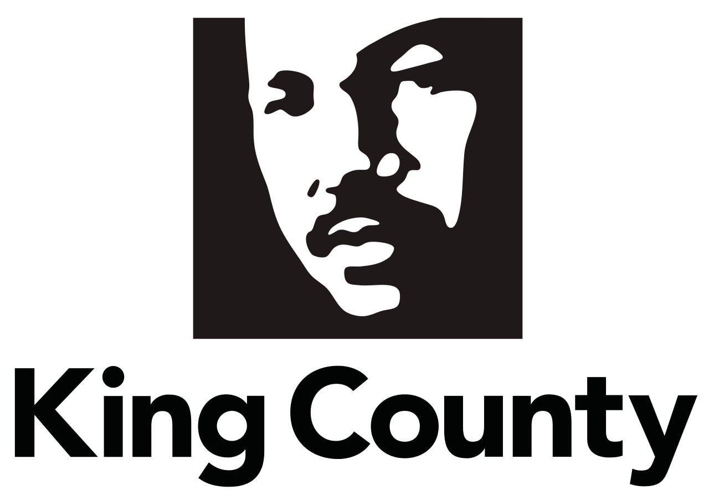

# King County Housing Data Analysis

## Table of Contents
* [Project_Overview](#project-overview)
* [The_Data](#the-data)
* [Analysis](#analysis)
## Project Overview

This repository analyzes the data on the King County Home sales to create a linear regression model capable of prediting home prices based on the existing home sales data. Our objective is to create a model that has a low Root Mean Squared Error (RMSE) which means that our prediction does not stray far the model.

### The Data

This project uses the King County House Sales dataset, which can be found in  `kc_house_data.csv` in the data folder in this repo. The descriptions for the King County Data Set is shown below.

* id: unique identification for the house
* date: the date the house was sold
* price: Price of the home
* bedrooms: number of bedrooms
* bathrooms: number of bathrooms
* sqft_living: sqft of the home
* sqft_lot: sqft of the lot
* floors: number of floors
* waterfront: house with a view to waterfront
* view: has been viewed
* condition: condition of the home overall
* grade: overall grade given based on King County system
* sqft_above: sqft of house apart from basement
* sqft_basement: sqft of basement
* yr_built: year the home was built
* yr_renovated: year when home is renovated
* zipcode: zipcode
* lat: latitude coordinates
* long: longitude coordinate
* sqft_living: sqft of living space for the nearest 15 neighbors
* sqft_lot15: sqft of land of the nearest 15 neighbors

Based on the information of the dataset, some data such as date and id are not particularly useful to predicting the price of a home and were not considered.

### Business Problem

Realestate Investors have come to #company name# and requested a model to preduct home prices. 

If you are struggling to define a stakeholder, we recommend you complete a project for a real estate agency that helps homeowners buy and/or sell homes. A business problem you could focus on for this stakeholder is the need to provide advice to homeowners about how home renovations might increase the estimated value of their homes, and by what amount.

## Analysis

The first steps of the analysis is to analyze and interprit the data and to clean the missing values in the dataset. 

## Deliverables

There are three deliverables for this project:

* A **GitHub repository**
* A **Jupyter Notebook**
* A **non-technical presentation**

Review the "Project Submission & Review" page in the "Milestones Instructions" topic for instructions on creating and submitting your deliverables. Refer to the rubric associated with this assignment for specifications describing high-quality deliverables.

### Key Points

* **Your deliverables should explicitly address each step of the data science process.** Refer to [the Data Science Process lesson](https://github.com/learn-co-curriculum/dsc-data-science-processes) from Topic 19 for more information about process models you can use.

* **Your Jupyter Notebook should demonstrate an iterative approach to modeling.** This means that you begin with a basic model, evaluate it, and then provide justification for and proceed to a new model. After you finish refining your models, you should provide 1-3 paragraphs discussing your final model - this should include interpreting at least 3 important parameter estimates or statistics.

* **Based on the results of your models, your notebook and presentation should discuss at least two features that have strong relationships with housing prices.**

## Getting Started

Start on this project by forking and cloning [this project repository](https://github.com/learn-co-curriculum/dsc-phase-2-project) to get a local copy of the dataset.

We recommend structuring your project repository similar to the structure in [the Phase 1 Project Template](https://github.com/learn-co-curriculum/dsc-project-template). You can do this either by creating a new fork of that repository to work in or by building a new repository from scratch that mimics that structure.

## Project Submission and Review

Review the "Project Submission & Review" page in the "Milestones Instructions" topic to learn how to submit your project and how it will be reviewed. Your project must pass review for you to progress to the next Phase.

## Summary

This project will give you a valuable opportunity to develop your data science skills using real-world data. The end-of-phase projects are a critical part of the program because they give you a chance to bring together all the skills you've learned, apply them to realistic projects for a business stakeholder, practice communication skills, and get feedback to help you improve. You've got this!
