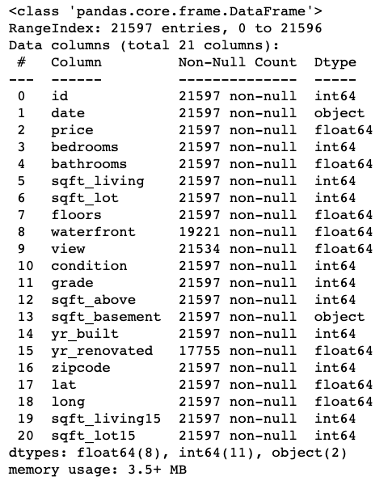
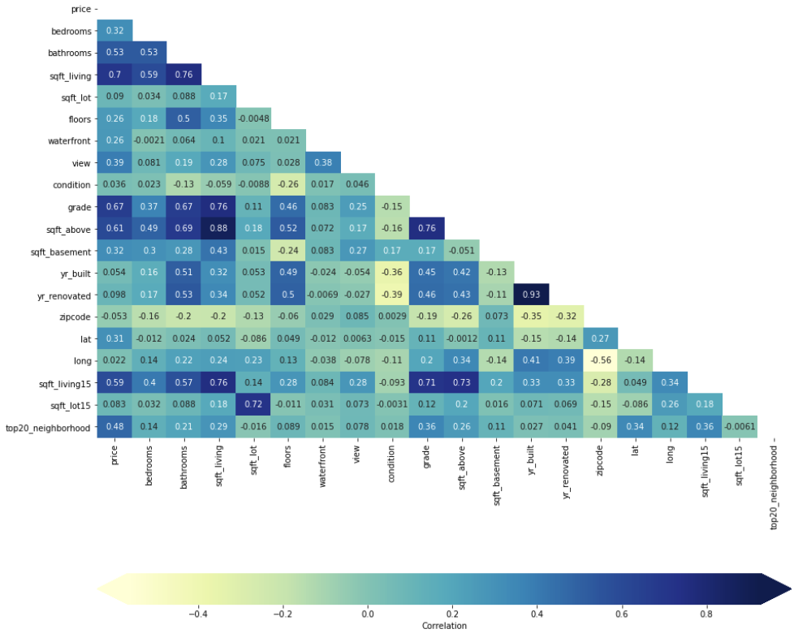

# King County Housing Data Analysis

## Table of Contents
* [Project_Overview](#project-overview)
* [The_Data](#the-data)
* [Analysis](#analysis)
* [Data Cleaning](#data-cleaning)

## Project Overview

This repository analyzes the data on the King County Home sales to create a linear regression model capable of predicting home prices based on the existing home sales data. Our objective is to create a model using a house sales database based in King Country, Washington. The goal of our model is to have a low Root Mean Squared Error (RMSE) so we know that our prediction does not stray far the model. By using regression techniques, we were able to identify how the sales price of houses can change when doing different renovations, making our model a useful tool for someone going into the house flipping business.

### Business Problem

Our real estate holding group startup Detova Veda is making a pitch to help smaller investors compete against established real estate investment firms. In order to show that we can help clients in their venture, we must show that our product can accurately predict how well an upgrade in any aspect of a home will impact its sale price. This predictive model will use these small investors to infiltrate the real estate investment market. To provide an answer, we looked into the question: what is the most impactful way you can increase the value of a home?

This is an important question, because real estate is a high stakes industry. Investors will want a direction to go where they can be confident they will get a return on their investment. Therefore, we must provide a concrete answer for them.

### The Data

This project uses the King County House Sales dataset, which can be found in  `kc_house_data.csv` in the data folder in this repo. The dataset included houses in King County built between 1900 and 2015. The descriptions of the dataset's columns is shown below.

* id: unique identification for the house
* date: the date the house was sold
* price: Price of the home
* bedrooms: number of bedrooms
* bathrooms: number of bathrooms
* sqft_living: sqft of the home
* sqft_lot: sqft of the lot
* floors: number of floors
* waterfront: house with a view to waterfront
* view: has been viewed
* condition: condition of the home overall
* grade: overall grade given based on King County system
* sqft_above: sqft of house apart from basement
* sqft_basement: sqft of basement
* yr_built: year the home was built
* yr_renovated: year when home is renovated
* zipcode: zipcode
* lat: latitude coordinates
* long: longitude coordinate
* sqft_living: sqft of living space for the nearest 15 neighbors
* sqft_lot15: sqft of land of the nearest 15 neighbors

## Data Cleaning:

The first thing to check for in any data set is making sure the data types lined up with the actual data it contained. The sqft_basement column was a column of measurements but the values were stored as objects. Therefore, we had to convert them to floats. At the same time, we converted the year built column from floats to ints, and smoothed out an obvious outlier of a 33 bedroom house. We also filled the null values of homes with no view, basement, or waterfront location to values of 0. We also dropped the ID and date columns which were not necessary for our analysis. 

## Analysis

We first cerated our baseline model using a Dummy Regressor. 

The first simple model was creatied by selecting all features with a correlation score > 0.5. This model performed poorly with only a R squared value of 0.510 which describes how well the the model fits the data. Different factors and were tested and many models were analyzied and we finalized on a model with an R squared value of 0.75. How the model fit isn't the end of the analysis. A model not only has to take the fit into consideration but the possible variations as well. Our final model ended up with a root mean square error (RMSE) of approximately $110,000. This means that our predicted data at any point can be off by $110,000 which is pretty substantial given that the average home price in King County was $540,296. This data can be refined further with more analysis and more data. Thorough cleaning can remove more outliers to provide a better fit for the models.

## Deliverables

There are three deliverables for this project:

* A **GitHub repository**
* A **Jupyter Notebook**
* A **non-technical presentation**

Review the "Project Submission & Review" page in the "Milestones Instructions" topic for instructions on creating and submitting your deliverables. Refer to the rubric associated with this assignment for specifications describing high-quality deliverables.

### Key Points

* **Your deliverables should explicitly address each step of the data science process.** Refer to [the Data Science Process lesson](https://github.com/learn-co-curriculum/dsc-data-science-processes) from Topic 19 for more information about process models you can use.

* **Your Jupyter Notebook should demonstrate an iterative approach to modeling.** This means that you begin with a basic model, evaluate it, and then provide justification for and proceed to a new model. After you finish refining your models, you should provide 1-3 paragraphs discussing your final model - this should include interpreting at least 3 important parameter estimates or statistics.

* **Based on the results of your models, your notebook and presentation should discuss at least two features that have strong relationships with housing prices.**

## Getting Started

Start on this project by forking and cloning [this project repository](https://github.com/learn-co-curriculum/dsc-phase-2-project) to get a local copy of the dataset.

We recommend structuring your project repository similar to the structure in [the Phase 1 Project Template](https://github.com/learn-co-curriculum/dsc-project-template). You can do this either by creating a new fork of that repository to work in or by building a new repository from scratch that mimics that structure.

## Project Submission and Review

Review the "Project Submission & Review" page in the "Milestones Instructions" topic to learn how to submit your project and how it will be reviewed. Your project must pass review for you to progress to the next Phase.

## Summary

This project will give you a valuable opportunity to develop your data science skills using real-world data. The end-of-phase projects are a critical part of the program because they give you a chance to bring together all the skills you've learned, apply them to realistic projects for a business stakeholder, practice communication skills, and get feedback to help you improve. You've got this!
