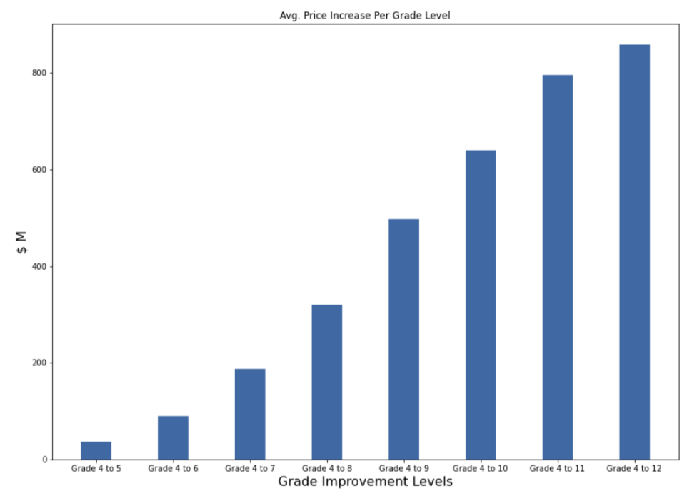

# King County Housing Data Analysis

## Table of Contents
* [Project_Overview](#project-overview)
* [The_Data](#the-data)
* [Analysis](#analysis)
* [Data Cleaning](#data-cleaning)
* [Conclusion](#conclusion)
* [Team](#team)
* [Appendix](#appendix)

## Project Overview

This repository analyzes the data on the King County Home sales to create a linear regression model capable of predicting home prices based on the existing home sales data. Our objective is to create a model using a house sales database based in King Country, Washington. The goal of our model is to have a low Root Mean Squared Error (RMSE) so we know that our prediction does not stray far the model. By using regression techniques, we were able to identify how the sales price of houses can change when doing different renovations, making our model a useful tool for someone going into the house flipping business.

### Business Problem

Our real estate holding group startup Detova Veda is making a pitch to help smaller investors compete against established real estate investment firms. In order to show that we can help clients in their venture, we must show that our product can accurately predict how well an upgrade in any aspect of a home will impact its sale price. This predictive model will use these small investors to infiltrate the real estate investment market. To provide an answer, we looked into the question: what is the most impactful way you can increase the value of a home?

This is an important question, because real estate is a high stakes industry. Investors will want a direction to go where they can be confident they will get a return on their investment. Therefore, we must provide a concrete answer for them.

### The Data

This project uses the King County House Sales dataset, which can be found in  `kc_house_data.csv` in the data folder in this repo. The dataset included houses in King County built between 1900 and 2015. The descriptions of the dataset's columns is shown below.

* id: unique identification for the house
* date: the date the house was sold
* price: Price of the home
* bedrooms: number of bedrooms
* bathrooms: number of bathrooms
* sqft_living: sqft of the home
* sqft_lot: sqft of the lot
* floors: number of floors
* waterfront: house with a view to waterfront
* view: has been viewed
* condition: condition of the home overall
* grade: overall grade given based on King County system
* sqft_above: sqft of house apart from basement
* sqft_basement: sqft of basement
* yr_built: year the home was built
* yr_renovated: year when home is renovated
* zipcode: zipcode
* lat: latitude coordinates
* long: longitude coordinate
* sqft_living: sqft of living space for the nearest 15 neighbors
* sqft_lot15: sqft of land of the nearest 15 neighbors

## Data Cleaning

The first thing to check for in any data set is making sure the data types lined up with the actual data it contained. The sqft_basement column was a column of measurements but the values were stored as objects. Therefore, we had to convert them to floats. At the same time, we converted the year built column from floats to ints, and smoothed out an obvious outlier of a 33 bedroom house. We also filled the null values of homes with no view, basement, or waterfront location to values of 0. We also dropped the ID and date columns which were not necessary for our analysis. 

## Analysis

We first cerated our baseline model using a Dummy Regressor. 

The first simple model was creatied by selecting all features with a correlation score > 0.5. This model performed poorly with only a R squared value of 0.510 which describes how well the the model fits the data. Different factors and were tested and many models were analyzied and we finalized on a model with an R squared value of 0.75. How the model fit isn't the end of the analysis. A model not only has to take the fit into consideration but the possible variations as well. Our final model ended up with a root mean square error (RMSE) of approximately $110,000. This means that our predicted data at any point can be off by $110,000 which is pretty substantial given that the average home price in King County was $540,296. This data can be refined further with more analysis and more data. Thorough cleaning can remove more outliers to provide a better fit for the models.

## Conclusion

When looking into a house a lot of factors need to be considerd. Looking into the data, we find that many of the values are colinear meaning that that these factors drive the price up but also relate to one another. Some examples of these factors are sqft_living to sqft_above and grade to sqft_above. Taking these into considerations, we decided to pick two factors from our data that impacted the price the most and that is the most applicable for someone trying to flip a house. These factors were condition and grade. 

From this graph we can see that there is a significant gain in the value of the home as we increase the grade.

## Team
- Tony Bai  
    Github: Tm4gic  
- Jax Garnett  
    Github: pleasecallmejax  
- Eddie Lin  
    Github: RedDragonfruit  
- Brett Zimmerman  
    Github: Brettzim  

## Appendix

[king_county_info](https://info.kingcounty.gov/assessor/esales/Glossary.aspx?type=r#g)

